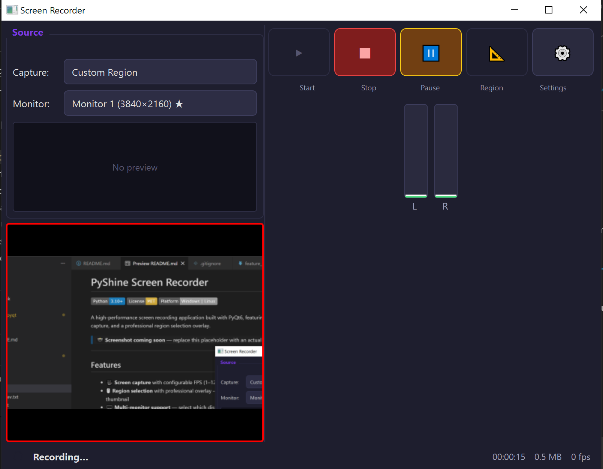

# PyShine Screen Recorder

[](https://www.python.org/downloads/)
[](https://opensource.org/licenses/MIT)
[](https://github.com)

A high-performance screen recording application built with PyQt6, featuring hardware-accelerated video encoding, multi-source audio capture, and a professional region selection overlay.

Screenshot placeholder -->



## Features

- 🎥 **Screen capture** with configurable FPS (1–120)
- 🖱️ **Region selection** with professional overlay — 8 resize handles, drag-to-move, confirm/cancel buttons, and a live preview thumbnail
- 🖥️ **Multi-monitor support** — select which display to capture
- ⚡ **Hardware-accelerated video encoding** — NVENC (NVIDIA), QSV (Intel), AMF (AMD), or x264 (CPU fallback)
- 🎙️ **Audio recording** — microphone via `sounddevice`, system audio via WASAPI loopback (`pyaudiowpatch`)
- 🔔 **System tray icon** with recording controls (start/stop/pause/resume)
- 📺 **Live preview** during recording with reduced-overhead frame skipping
- 🎚️ **Audio level meter** — real-time RMS and peak monitoring
- ⚙️ **Settings panel** — output directory, video quality, audio source, and more
- 📜 **Recording history** — tracks past recordings with metadata
- ⏸️ **Pause/resume support** during active recording
- 📦 **MP4 output** via PyAV (FFmpeg bindings)

---

## Requirements

| Requirement | Minimum |
|---|---|
| Python | 3.10+ |
| Operating System | Windows 10+ (primary), Linux (partial) |
| RAM | 4 GB |
| CPU | Dual-core |
| GPU | Integrated graphics (discrete with NVENC/QSV/AMF recommended) |

### Python Dependencies

| Package | Version | Purpose |
|---|---|---|
| PyQt6 | ≥ 6.5.0 | GUI framework |
| mss | ≥ 9.0.0 | Screen capture |
| av | ≥ 10.0.0 | Video/audio encoding (FFmpeg bindings) |
| numpy | ≥ 1.24.0 | Frame data handling |
| sounddevice | ≥ 0.4.6 | Microphone audio capture |
| pyaudiowpatch | ≥ 0.2.12 | WASAPI loopback (system audio) |
| Pillow | ≥ 10.0.0 | Image processing |

---

## Installation

### From Source (Recommended)

```bash
# Clone the repository
git clone https://github.com/pyshine-labs/PyShine-Screen-Recorder.git
cd screen-recorder-pyqt

# Create a virtual environment (recommended)
python -m venv .venv
# Windows:
.venv\Scripts\activate
# Linux/macOS:
source .venv/bin/activate

# Install the package in development mode
pip install -e .

# Or install dependencies directly
pip install -r requirements.txt
```

### Development Setup

```bash
# Install with development dependencies
pip install -e ".[dev]"

# Or install dev dependencies separately
pip install -r requirements-dev.txt
```

---

## Usage

### Running the Application

```bash
# From the project root directory
python -m screen_recorder
```

Or, after `pip install -e .`:

```bash
screen-recorder
```

### Keyboard Shortcuts

| Shortcut | Action |
|---|---|
| `Ctrl+R` | Start recording |
| `Ctrl+S` | Stop recording |
| `Ctrl+P` | Pause / Resume recording |
| `Ctrl+Q` | Quit application |
| `Esc` | Cancel region selection |

### Basic Workflow

1. **Launch** the application — the main window appears with a preview area and controls.
2. **Select a capture source** — choose a display or draw a region using the overlay selector.
3. **Configure audio** — enable microphone and/or system audio in Settings.
4. **Start recording** — click the Record button or press `Ctrl+R`.
5. **Stop recording** — click Stop or press `Ctrl+S`. The MP4 file is saved to your output directory.

---

## Project Structure

```
screen_recorder_pyqt/
├── pyproject.toml                  # Project configuration (PEP 621)
├── requirements.txt                # Runtime dependencies
├── requirements-dev.txt             # Development dependencies
├── README.md                        # This file
├── LICENSE                          # MIT License
│
├── src/screen_recorder/
│   ├── __init__.py                  # Package metadata
│   ├── __main__.py                  # Entry point (python -m screen_recorder)
│   ├── app.py                       # Application lifecycle & recording pipeline
│   │
│   ├── audio/                       # Audio capture & processing
│   │   ├── __init__.py
│   │   ├── audio_capture.py          # Microphone & WASAPI loopback capture
│   │   ├── audio_mixer.py            # Multi-source audio mixing
│   │   └── device_enumerator.py      # Audio device discovery
│   │
│   ├── capture/                     # Screen capture & region selection
│   │   ├── __init__.py
│   │   ├── display_info.py           # Multi-monitor detection
│   │   ├── region_selector.py        # Region selection overlay (8 handles, preview)
│   │   └── screen_capture.py         # MSS-based frame capture
│   │
│   ├── config/                      # Configuration & persistence
│   │   ├── __init__.py
│   │   ├── hotkey_manager.py         # Global keyboard shortcuts
│   │   ├── recording_history.py      # Recording history (JSON storage)
│   │   └── settings_manager.py       # QSettings-based configuration
│   │
│   ├── encoding/                    # Video & audio encoding
│   │   ├── __init__.py
│   │   ├── audio_encoder.py          # AAC audio encoding via PyAV
│   │   ├── output_writer.py          # MP4 muxing & file output
│   │   └── video_encoder.py          # H.264 encoding (NVENC/QSV/AMF/x264)
│   │
│   ├── gui/                         # PyQt6 user interface
│   │   ├── __init__.py
│   │   ├── audio_meter.py            # Real-time audio level meter
│   │   ├── history_panel.py          # Recording history list
│   │   ├── main_window.py            # Main application window
│   │   ├── preview_widget.py         # Live preview display
│   │   ├── recorder_controls.py      # Start/stop/pause buttons
│   │   ├── settings_panel.py          # Settings configuration panel
│   │   ├── source_selector.py        # Display/region source picker
│   │   ├── status_bar.py             # Recording status indicator
│   │   └── system_tray.py            # System tray icon & menu
│   │
│   └── utils/                        # Utilities
│       ├── __init__.py
│       └── logger.py                  # Logging configuration
│
├── resources/                        # Application resources
│   └── icons/                         # Tray icons & app icon
│
└── docs/                             # Documentation
    └── ARCHITECTURE.md                # Architecture & design document
```

---

## Architecture

For a detailed overview of the application architecture, threading model, data flow, and module design, see [`docs/ARCHITECTURE.md`](docs/ARCHITECTURE.md).

Key architectural highlights:

- **Qt Signal/Slot pattern** — all inter-module communication uses PyQt6 signals for thread safety
- **Separate threads** — capture, encoding, and audio run on dedicated `QThread` instances
- **Hardware encoder auto-detection** — NVENC → QSV → AMF → x264 fallback chain
- **Frame-pool memory management** — pre-allocated numpy arrays minimize GC pressure during recording

---

## Configuration

Settings are stored in the platform's standard configuration directory:

| Platform | Path |
|---|---|
| Windows | `%APPDATA%\ScreenRecorder\PyQtScreenRecorder\settings.json` |
| Linux | `~/.config/ScreenRecorder/PyQtScreenRecorder/settings.json` |

### Available Settings

| Category | Setting | Default | Description |
|---|---|---|---|
| **Video** | `encoder` | `auto` | Encoder: `auto`, `nvenc`, `qsv`, `amf`, `x264` |
| | `codec` | `h264` | Video codec |
| | `bitrate` | `5000` | Target bitrate (kbps) |
| | `frame_rate` | `30` | Capture FPS |
| | `quality_preset` | `medium` | Encoding preset |
| **Audio** | `sample_rate` | `48000` | Audio sample rate (Hz) |
| | `channels` | `2` | Channels (1=mono, 2=stereo) |
| | `microphone_enabled` | `true` | Enable microphone capture |
| | `system_audio_enabled` | `false` | Enable system audio loopback |
| **General** | `output_directory` | `~/Documents/Screen Recordings` | Output folder |
| | `minimize_to_tray` | `true` | Minimize to system tray |
| | `show_notifications` | `true` | Show desktop notifications |
| | `theme` | `dark` | UI theme |

---

## Audio Notes

### WASAPI Loopback (System Audio)

System audio capture on Windows uses **WASAPI loopback** via `pyaudiowpatch`. This allows recording whatever plays through your speakers without a virtual audio cable.

**Requirements:**
- Windows 10+ (WASAPI loopback is a Windows-specific API)
- `pyaudiowpatch >= 0.2.12` must be installed
- The loopback device must be available (some virtual audio drivers may interfere)

### Mono/Stereo Auto-Detection

The application automatically detects the channel layout of the selected audio device:

- **Mono devices** (1 channel) → encoded as mono AAC
- **Stereo devices** (2+ channels) → encoded as stereo AAC

If the WASAPI loopback device reports a different sample rate than the encoder expects, the application handles resampling transparently.

### Known Audio Limitations

- System audio loopback is **Windows-only** — Linux users should use PulseAudio monitor sources.
- Some USB microphones may require exclusive mode to be disabled in Windows sound settings.
- Audio and video timestamps are synchronized using PTS tracking; drift is corrected at encode time.

---

## Contributing

Contributions are welcome! Here's how to get started:

1. **Fork** the repository on GitHub
2. **Create a feature branch**: `git checkout -b feature/my-new-feature`
3. **Make your changes** and add tests where applicable
4. **Run the test suite**: `pytest`
5. **Format your code**: `black .` and `isort .`
6. **Type-check**: `mypy src/screen_recorder`
7. **Commit** with a descriptive message: `git commit -m "Add amazing feature"`
8. **Push** to your fork: `git push origin feature/my-new-feature`
9. **Open a Pull Request** against the `main` branch

### Development Guidelines

- Follow **PEP 8** style (enforced by `black`)
- Add **type hints** to all public functions (enforced by `mypy --strict`)
- Write **docstrings** for all classes and public methods
- Keep the **module structure** — new features should fit the existing package layout
- Test on **Windows 10/11** before submitting PRs

---

## License

This project is licensed under the **MIT License** — see the [LICENSE](LICENSE) file for details.

```
MIT License

Copyright (c) 2025 PyShine Labs

Permission is hereby granted, free of charge, to any person obtaining a copy
of this software and associated documentation files (the "Software"), to deal
in the Software without restriction, including without limitation the rights
to use, copy, modify, merge, publish, distribute, sublicense, and/or sell
copies of the Software, and to permit persons to whom the Software is
furnished to do so, subject to the following conditions:

The above copyright notice and this permission notice shall be included in all
copies or substantial portions of the Software.

THE SOFTWARE IS PROVIDED "AS IS", WITHOUT WARRANTY OF ANY KIND, EXPRESS OR
IMPLIED, INCLUDING BUT NOT LIMITED TO THE WARRANTIES OF MERCHANTABILITY,
FITNESS FOR A PARTICULAR PURPOSE AND NONINFRINGEMENT. IN NO EVENT SHALL THE
AUTHORS OR COPYRIGHT HOLDERS BE LIABLE FOR ANY CLAIM, DAMAGES OR OTHER
LIABILITY, WHETHER IN AN ACTION OF CONTRACT, TORT OR OTHERWISE, ARISING FROM,
OUT OF OR IN CONNECTION WITH THE SOFTWARE OR THE USE OR OTHER DEALINGS IN THE
SOFTWARE.