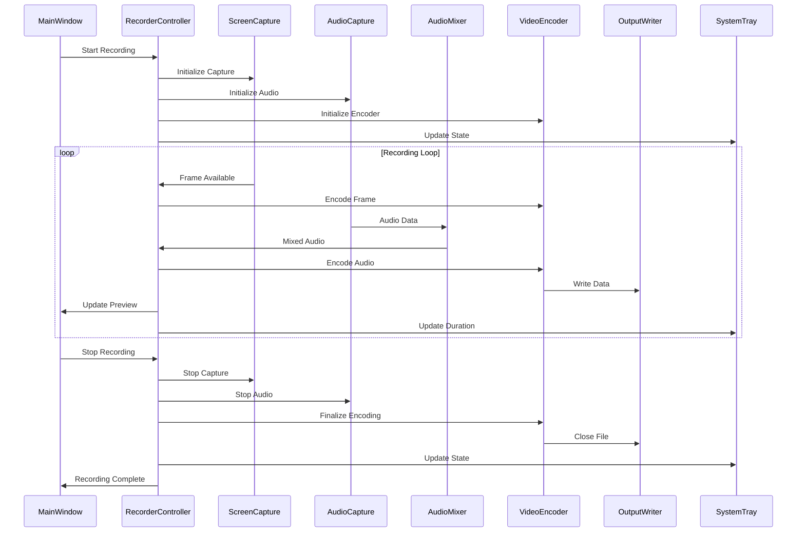
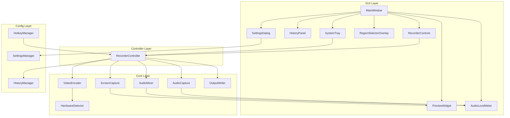

# PyQt6 Screen Recorder - Architecture Document

## Table of Contents

1. [Executive Summary](#executive-summary)
2. [Technology Stack Selection](#technology-stack-selection)
3. [Project Structure](#project-project-structure)
4. [Module Design](#module-design)
5. [GUI Components](#gui-components)
6. [Data Flow](#data-flow)
7. [Threading Model](#threading-model)
8. [Dependencies](#dependencies)
9. [Performance Considerations](#performance-considerations)
10. [Migration from Electron](#migration-from-electron)

---

## Executive Summary

This document outlines the architecture for a PyQt6-based screen recording application designed to replace the existing Electron implementation. The application provides high-performance screen capture with configurable resolution, multi-source audio recording, and hardware-accelerated video encoding.

### Key Design Goals

- **Native Performance**: Leverage Python's native capabilities with PyQt6 for optimal performance
- **Hardware Acceleration**: Support NVENC, QSV, and VCE hardware encoding via PyAV
- **Modern UI**: Clean, responsive PyQt6 interface with dark theme support
- **Cross-Platform Foundation**: Primary focus on Windows with potential for cross-platform support
- **Maintainability**: Clear module separation and well-defined interfaces

### Feature Parity with Electron Implementation

| Feature | Electron | PyQt6 |
|---------|----------|-------|
| Screen capture with selectable regions | ✅ desktopCapturer | ✅ mss/pyautogui |
| Video recording with hardware encoding | ✅ MediaRecorder | ✅ PyAV |
| Audio recording (microphone + system) | ✅ WASAPI | ✅ sounddevice/pyaudio |
| System tray icon with controls | ✅ Electron Tray | ✅ QSystemTrayIcon |
| Region selection overlay | ✅ Transparent BrowserWindow | ✅ QWidget with Qt::WindowTransparentForInput |
| Recording history | ✅ JSON storage | ✅ JSON + QSettings |
| Settings management | ✅ electron-store | ✅ QSettings + JSON |

---

## Technology Stack Selection

### Core Technologies

| Component | Technology | Rationale |
|-----------|------------|-----------|
| GUI Framework | PyQt6 | Modern Qt6 bindings, native look, extensive widget library |
| Language | Python 3.11+ | Type hints, async support, extensive ecosystem |
| Screen Capture | mss | Fast, cross-platform, minimal dependencies |
| Video Encoding | PyAV | FFmpeg bindings with hardware acceleration support |
| Audio Capture | sounddevice | Low-latency, cross-platform audio I/O |
| System Audio | pyaudiowpatch | Windows audio loopback support |
| Settings | QSettings | Native Qt settings with JSON fallback |

### Why PyQt6 Over Electron

| Aspect | Electron | PyQt6 |
|--------|---------|-------|
| Memory footprint | ~150-300 MB | ~50-100 MB |
| Startup time | 1-3 seconds | 0.3-1 second |
| Distribution size | ~150 MB | ~30-50 MB |
| Native integration | Limited via IPC | Direct API access |
| Hardware access | Requires native addons | Direct via Python bindings |

---

## Project Structure

```
screen_recorder_pyqt/
├── pyproject.toml              # Project configuration (PEP 621)
├── setup.py                    # Setup script for pip install
├── requirements.txt            # Python dependencies
├── requirements-dev.txt        # Development dependencies
├── README.md                   # Project documentation
├── LICENSE                     # MIT License
│
├── src/
│   ├── __init__.py
│   ├── main.py                 # Application entry point
│   ├── app.py                  # QApplication setup and lifecycle
│   │
│   ├── core/                   # Core functionality modules
│   │   ├── __init__.py
│   │   ├── capture/            # Screen capture module
│   │   │   ├── __init__.py
│   │   │   ├── screen_capture.py      # MSS-based screen capture
│   │   │   ├── display_enumerator.py  # Display detection
│   │   │   ├── region_selector.py     # Region selection logic
│   │   │   └── frame_pool.py          # Frame buffer management
│   │   │
│   │   ├── encoding/           # Video encoding module
│   │   │   ├── __init__.py
│   │   │   ├── video_encoder.py       # PyAV video encoding
│   │   │   ├── hardware_detector.py   # GPU encoder detection
│   │   │   ├── encoder_manager.py     # Encoder orchestration
│   │   │   └── output_writer.py       # File output handling
│   │   │
│   │   ├── audio/              # Audio capture module
│   │   │   ├── __init__.py
│   │   │   ├── audio_capture.py       # sounddevice capture
│   │   │   ├── audio_mixer.py         # Multi-source mixing
│   │   │   ├── device_enumerator.py   # Audio device detection
│   │   │   └── audio_synchronizer.py  # A/V sync handling
│   │   │
│   │   └── config/             # Configuration module
│   │       ├── __init__.py
│   │       ├── settings_manager.py    # QSettings-based config
│   │       ├── hotkey_manager.py      # Global hotkey handling
│   │       └── recording_history.py   # Recording history DB
│   │
│   ├── gui/                    # PyQt6 GUI components
│   │   ├── __init__.py
│   │   ├── main_window.py             # Main application window
│   │   ├── system_tray.py             # QSystemTrayIcon manager
│   │   │
│   │   ├── widgets/            # Reusable widgets
│   │   │   ├── __init__.py
│   │   │   ├── recorder_controls.py   # Start/stop/pause buttons
│   │   │   ├── region_selector_overlay.py  # Transparent overlay
│   │   │   ├── audio_level_meter.py   # Real-time audio meter
│   │   │   ├── preview_widget.py      # Live preview display
│   │   │   └── status_bar.py          # Recording status bar
│   │   │
│   │   ├── dialogs/            # Dialog windows
│   │   │   ├── __init__.py
│   │   │   ├── settings_dialog.py     # Settings configuration
│   │   │   ├── about_dialog.py        # About window
│   │   │   └── save_dialog.py         # Save location dialog
│   │   │
│   │   ├── panels/             # Panel components
│   │   │   ├── __init__.py
│   │   │   ├── history_panel.py       # Recording history list
│   │   │   ├── source_panel.py        # Source selection
│   │   │   └── audio_panel.py         # Audio settings panel
│   │   │
│   │   └── styles/             # Styling
│   │       ├── __init__.py
│   │       ├── dark_theme.py          # Dark theme stylesheet
│   │       └── light_theme.py         # Light theme stylesheet
│   │
│   └── utils/                   # Utility modules
│       ├── __init__.py
│       ├── logger.py                  # Logging configuration
│       ├── platform_utils.py          # Platform-specific utilities
│       ├── file_utils.py              # File operations
│       └── signal_bus.py              # Application-wide signals
│
├── tests/                       # Test suite
│   ├── __init__.py
│   ├── conftest.py                     # Pytest fixtures
│   ├── unit/
│   │   ├── __init__.py
│   │   ├── test_capture.py
│   │   ├── test_encoding.py
│   │   ├── test_audio.py
│   │   └── test_config.py
│   ├── integration/
│   │   ├── __init__.py
│   │   └── test_recording_flow.py
│   └── gui/
│       ├── __init__.py
│       └── test_main_window.py
│
├── resources/                   # Application resources
│   ├── icons/
│   │   ├── app.ico                     # Application icon
│   │   ├── tray_idle.png              # Tray icon - idle
│   │   ├── tray_recording.png         # Tray icon - recording
│   │   ├── tray_paused.png            # Tray icon - paused
│   │   └── tray_error.png             # Tray icon - error
│   ├── sounds/
│   │   ├── start.wav                  # Recording start sound
│   │   └── stop.wav                   # Recording stop sound
│   └── styles/
│       └── default.qss               # Default stylesheet
│
└── docs/                        # Documentation
    ├── ARCHITECTURE.md                 # This document
    ├── USER_GUIDE.md                  # User documentation
    └── DEVELOPER_GUIDE.md             # Development guide
```

---

## Module Design

### 1. ScreenCapture Module

**Location**: [`src/core/capture/`](src/core/capture/)

The screen capture module handles all screen, window, and region capture operations.

```python
# src/core/capture/screen_capture.py

from dataclasses import dataclass
from typing import Optional, List, Callable
from enum import Enum
import mss
import numpy as np
from PyQt6.QtCore import QObject, pyqtSignal, QThread

class CaptureType(Enum):
    SCREEN = "screen"
    WINDOW = "window"
    REGION = "region"

@dataclass
class DisplayInfo:
    id: str
    name: str
    bounds: dict  # {x, y, width, height}
    is_primary: bool
    scale_factor: float

@dataclass
class CaptureConfig:
    capture_type: CaptureType
    display_id: Optional[str] = None
    region: Optional[dict] = None  # {x, y, width, height}
    frame_rate: int = 30
    show_cursor: bool = True

@dataclass
class Frame:
    data: np.ndarray
    width: int
    height: int
    timestamp: float
    format: str = "bgra"

class ScreenCapture(QObject):
    """Core screen capture using MSS library."""
    
    frame_captured = pyqtSignal(object)  # Frame
    error_occurred = pyqtSignal(str)
    
    def __init__(self, config: CaptureConfig):
        super().__init__()
        self._config = config
        self._sct = mss.mss()
        self._is_capturing = False
        self._frame_callback: Optional[Callable] = None
        
    def get_displays(self) -> List[DisplayInfo]:
        """Enumerate all available displays."""
        displays = []
        for i, monitor in enumerate(self._sct.monitors[1:], 1):
            displays.append(DisplayInfo(
                id=str(i),
                name=f"Display {i}",
                bounds={
                    "x": monitor["left"],
                    "y": monitor["top"],
                    "width": monitor["width"],
                    "height": monitor["height"]
                },
                is_primary=(i == 1),
                scale_factor=1.0
            ))
        return displays
    
    def start_capture(self) -> None:
        """Start capturing frames."""
        self._is_capturing = True
        
    def stop_capture(self) -> None:
        """Stop capturing frames."""
        self._is_capturing = False
        
    def capture_frame(self) -> Optional[Frame]:
        """Capture a single frame."""
        if self._config.capture_type == CaptureType.SCREEN:
            return self._capture_screen()
        elif self._config.capture_type == CaptureType.REGION:
            return self._capture_region()
        return None
        
    def _capture_screen(self) -> Frame:
        monitor = self._sct.monitors[int(self._config.display_id or 1)]
        screenshot = self._sct.grab(monitor)
        return Frame(
            data=np.array(screenshot),
            width=screenshot.width,
            height=screenshot.height,
            timestamp=time.time()
        )
        
    def _capture_region(self) -> Frame:
        region = self._config.region
        monitor = {
            "left": region["x"],
            "top": region["y"],
            "width": region["width"],
            "height": region["height"]
        }
        screenshot = self._sct.grab(monitor)
        return Frame(
            data=np.array(screenshot),
            width=screenshot.width,
            height=screenshot.height,
            timestamp=time.time()
        )
```

### 2. VideoEncoder Module

**Location**: [`src/core/encoding/`](src/core/encoding/)

The video encoder module handles hardware-accelerated encoding using PyAV.

```python
# src/core/encoding/video_encoder.py

from dataclasses import dataclass
from typing import Optional, List
from enum import Enum
import av
import numpy as np

class EncoderType(Enum):
    AUTO = "auto"
    NVENC = "nvenc"      # NVIDIA
    QSV = "qsv"          # Intel Quick Sync
    VCE = "vce"          # AMD
    X264 = "x264"        # Software

@dataclass
class EncoderConfig:
    encoder_type: EncoderType = EncoderType.AUTO
    codec: str = "h264"
    bitrate: int = 5000  # kbps
    frame_rate: int = 30
    width: int = 1920
    height: int = 1080
    preset: str = "medium"
    keyframe_interval: int = 2  # seconds

@dataclass
class EncoderCapabilities:
    supports_nvenc: bool
    supports_qsv: bool
    supports_vce: bool
    recommended_encoder: str

class VideoEncoder:
    """Hardware-accelerated video encoder using PyAV."""
    
    def __init__(self, config: EncoderConfig):
        self._config = config
        self._container: Optional[av.container.OutputContainer] = None
        self._stream: Optional[av.stream.Stream] = None
        self._is_encoding = False
        
    @staticmethod
    def detect_hardware() -> EncoderCapabilities:
        """Detect available hardware encoders."""
        capabilities = EncoderCapabilities(
            supports_nvenc=False,
            supports_qsv=False,
            supports_vce=False,
            recommended_encoder="x264"
        )
        
        # Check for NVENC
        try:
            test = av.Codec("h264_nvenc", "w")
            capabilities.supports_nvenc = True
            capabilities.recommended_encoder = "nvenc"
        except av.codec.UnknownCodecError:
            pass
            
        # Check for QSV
        try:
            test = av.Codec("h264_qsv", "w")
            capabilities.supports_qsv = True
            if not capabilities.supports_nvenc:
                capabilities.recommended_encoder = "qsv"
        except av.codec.UnknownCodecError:
            pass
            
        # Check for VCE/AMF
        try:
            test = av.Codec("h264_amf", "w")
            capabilities.supports_vce = True
            if not capabilities.supports_nvenc and not capabilities.supports_qsv:
                capabilities.recommended_encoder = "vce"
        except av.codec.UnknownCodecError:
            pass
            
        return capabilities
    
    def start_encoding(self, output_path: str) -> None:
        """Initialize encoder and create output file."""
        self._container = av.open(output_path, "w")
        
        # Select codec
        codec_name = self._get_codec_name()
        codec = av.Codec(codec_name, "w")
        
        self._stream = self._container.add_stream(codec, self._config.frame_rate)
        self._stream.width = self._config.width
        self._stream.height = self._config.height
        self._stream.pix_fmt = "yuv420p"
        self._stream.bit_rate = self._config.bitrate * 1000
        
        if hasattr(self._stream, "preset"):
            self._stream.preset = self._config.preset
            
        self._is_encoding = True
        
    def encode_frame(self, frame: np.ndarray, timestamp: float) -> None:
        """Encode a single video frame."""
        if not self._is_encoding:
            return
            
        # Convert BGRA to YUV420P
        av_frame = av.VideoFrame.from_ndarray(frame, format="bgra")
        av_frame.pict_type = av.video.PictureType.NONE
        
        for packet in self._stream.encode(av_frame):
            self._container.mux(packet)
            
    def stop_encoding(self) -> None:
        """Finalize encoding and close file."""
        if self._stream:
            for packet in self._stream.encode():
                self._container.mux(packet)
                
        if self._container:
            self._container.close()
            
        self._is_encoding = False
        
    def _get_codec_name(self) -> str:
        """Get the appropriate codec name based on config."""
        if self._config.encoder_type == EncoderType.AUTO:
            caps = self.detect_hardware()
            if caps.supports_nvenc:
                return "h264_nvenc"
            elif caps.supports_qsv:
                return "h264_qsv"
            elif caps.supports_vce:
                return "h264_amf"
            return "libx264"
            
        mapping = {
            EncoderType.NVENC: "h264_nvenc",
            EncoderType.QSV: "h264_qsv",
            EncoderType.VCE: "h264_amf",
            EncoderType.X264: "libx264"
        }
        return mapping.get(self._config.encoder_type, "libx264")
```

### 3. AudioCapture Module

**Location**: [`src/core/audio/`](src/core/audio/)

The audio module handles microphone and system audio capture.

```python
# src/core/audio/audio_capture.py

from dataclasses import dataclass
from typing import Optional, List, Callable
from enum import Enum
import sounddevice as sd
import numpy as np
from PyQt6.QtCore import QObject, pyqtSignal

class AudioSourceType(Enum):
    MICROPHONE = "microphone"
    SYSTEM = "system"  # Loopback

@dataclass
class AudioDeviceInfo:
    id: str
    name: str
    channels: int
    sample_rate: float
    is_input: bool
    is_default: bool

@dataclass
class AudioConfig:
    source_type: AudioSourceType
    device_id: Optional[str] = None
    sample_rate: int = 48000
    channels: int = 2
    volume: float = 1.0
    muted: bool = False

@dataclass
class AudioFrame:
    data: np.ndarray
    sample_rate: int
    channels: int
    timestamp: float

class AudioCapture(QObject):
    """Audio capture using sounddevice."""
    
    frame_ready = pyqtSignal(object)  # AudioFrame
    level_changed = pyqtSignal(float, float)  # level, peak
    error_occurred = pyqtSignal(str)
    
    def __init__(self, config: AudioConfig):
        super().__init__()
        self._config = config
        self._stream: Optional[sd.InputStream] = None
        self._is_capturing = False
        self._level = 0.0
        self._peak = 0.0
        
    @staticmethod
    def get_devices() -> List[AudioDeviceInfo]:
        """Enumerate all audio devices."""
        devices = []
        for i, dev in enumerate(sd.query_devices()):
            devices.append(AudioDeviceInfo(
                id=str(i),
                name=dev["name"],
                channels=dev["max_input_channels"],
                sample_rate=dev["default_samplerate"],
                is_input=dev["max_input_channels"] > 0,
                is_default=(i == sd.default.device[0])
            ))
        return devices
    
    def start_capture(self) -> None:
        """Start audio capture stream."""
        device_id = int(self._config.device_id) if self._config.device_id else None
        
        self._stream = sd.InputStream(
            device=device_id,
            channels=self._config.channels,
            samplerate=self._config.sample_rate,
            dtype=np.float32,
            callback=self._audio_callback
        )
        self._stream.start()
        self._is_capturing = True
        
    def stop_capture(self) -> None:
        """Stop audio capture stream."""
        if self._stream:
            self._stream.stop()
            self._stream.close()
            self._stream = None
        self._is_capturing = False
        
    def _audio_callback(self, indata: np.ndarray, frames: int, time_info, status):
        """Audio stream callback."""
        if not self._is_capturing:
            return
            
        # Apply volume
        data = indata.copy() * self._config.volume
        
        # Calculate level
        self._level = np.sqrt(np.mean(data ** 2))
        self._peak = np.max(np.abs(data))
        
        # Emit signals
        frame = AudioFrame(
            data=data,
            sample_rate=self._config.sample_rate,
            channels=self._config.channels,
            timestamp=time_info.currentTime
        )
        self.frame_ready.emit(frame)
        self.level_changed.emit(self._level, self._peak)
```

### 4. AudioMixer Module

**Location**: [`src/core/audio/audio_mixer.py`](src/core/audio/audio_mixer.py)

The audio mixer combines multiple audio sources.

```python
# src/core/audio/audio_mixer.py

from typing import Dict, List
import numpy as np
from PyQt6.QtCore import QObject

class AudioMixer(QObject):
    """Mixes multiple audio sources into a single output."""
    
    def __init__(self, sample_rate: int = 48000, channels: int = 2):
        super().__init__()
        self._sample_rate = sample_rate
        self._channels = channels
        self._sources: Dict[str, np.ndarray] = {}
        self._volumes: Dict[str, float] = {}
        self._muted: Dict[str, bool] = {}
        
    def add_source(self, source_id: str, volume: float = 1.0) -> None:
        """Add an audio source to the mixer."""
        self._sources[source_id] = np.zeros((1024, self._channels), dtype=np.float32)
        self._volumes[source_id] = volume
        self._muted[source_id] = False
        
    def remove_source(self, source_id: str) -> None:
        """Remove an audio source from the mixer."""
        self._sources.pop(source_id, None)
        self._volumes.pop(source_id, None)
        self._muted.pop(source_id, None)
        
    def add_frame(self, source_id: str, frame: np.ndarray) -> None:
        """Add audio frame from a source."""
        if source_id in self._sources:
            self._sources[source_id] = frame
            
    def mix(self) -> np.ndarray:
        """Mix all sources into a single output."""
        mixed = np.zeros_like(next(iter(self._sources.values())) if self._sources else np.zeros((1024, self._channels), dtype=np.float32))
        
        for source_id, frame in self._sources.items():
            if not self._muted.get(source_id, False):
                volume = self._volumes.get(source_id, 1.0)
                mixed += frame * volume
                
        # Normalize to prevent clipping
        max_val = np.max(np.abs(mixed))
        if max_val > 1.0:
            mixed = mixed / max_val
            
        return mixed
    
    def set_volume(self, source_id: str, volume: float) -> None:
        """Set volume for a source."""
        self._volumes[source_id] = max(0.0, min(1.0, volume))
        
    def mute(self, source_id: str) -> None:
        """Mute a source."""
        self._muted[source_id] = True
        
    def unmute(self, source_id: str) -> None:
        """Unmute a source."""
        self._muted[source_id] = False
```

### 5. RegionSelector Module

**Location**: [`src/gui/widgets/region_selector_overlay.py`](src/gui/widgets/region_selector_overlay.py)

The region selector provides a transparent overlay for selecting capture regions.

```python
# src/gui/widgets/region_selector_overlay.py

from typing import Optional, Tuple
from PyQt6.QtWidgets import QWidget, QApplication
from PyQt6.QtCore import Qt, QRect, pyqtSignal, QPoint
from PyQt6.QtGui import QPainter, QColor, QPen, QGuiApplication

class RegionSelectorOverlay(QWidget):
    """Transparent overlay for selecting screen regions."""
    
    region_selected = pyqtSignal(int, int, int, int)  # x, y, width, height
    selection_cancelled = pyqtSignal()
    
    def __init__(self):
        super().__init__()
        self._selection_start: Optional[QPoint] = None
        self._selection_end: Optional[QPoint] = None
        self._is_selecting = False
        
        self._setup_window()
        
    def _setup_window(self) -> None:
        """Configure window for transparent overlay."""
        # Get screen geometry for full screen overlay
        screen = QGuiApplication.primaryScreen()
        geometry = screen.geometry()
        
        self.setWindowFlags(
            Qt.WindowType.FramelessWindowHint |
            Qt.WindowType.WindowStaysOnTopHint |
            Qt.WindowType.Tool
        )
        self.setAttribute(Qt.WidgetAttribute.WA_TranslucentBackground)
        self.setAttribute(Qt.WidgetAttribute.WA_TransparentForMouseEvents, False)
        self.setGeometry(geometry)
        self.setCursor(Qt.CursorShape.CrossCursor)
        
    def show_overlay(self) -> None:
        """Show the overlay for region selection."""
        self.show()
        self.showFullScreen()
        self.activateWindow()
        
    def hide_overlay(self) -> None:
        """Hide the overlay."""
        self.hide()
        self._selection_start = None
        self._selection_end = None
        self._is_selecting = False
        
    def paintEvent(self, event) -> None:
        """Draw the selection rectangle."""
        painter = QPainter(self)
        
        # Semi-transparent background
        painter.fillRect(self.rect(), QColor(0, 0, 0, 100))
        
        if self._selection_start and self._selection_end:
            # Calculate selection rectangle
            rect = QRect(self._selection_start, self._selection_end).normalized()
            
            # Clear the selection area
            painter.setCompositionMode(QPainter.CompositionMode.CompositionMode_Clear)
            painter.fillRect(rect, Qt.GlobalColor.transparent)
            
            # Draw selection border
            painter.setCompositionMode(QPainter.CompositionMode.CompositionMode_SourceOver)
            pen = QPen(QColor(0, 120, 215), 2)
            painter.setPen(pen)
            painter.drawRect(rect)
            
            # Draw size indicator
            size_text = f"{rect.width()} x {rect.height()}"
            painter.drawText(rect.bottomRight() + QPoint(5, 15), size_text)
            
    def mousePressEvent(self, event) -> None:
        """Handle mouse press for selection start."""
        if event.button() == Qt.MouseButton.LeftButton:
            self._selection_start = event.pos()
            self._selection_end = event.pos()
            self._is_selecting = True
            self.update()
        elif event.button() == Qt.MouseButton.RightButton:
            self.selection_cancelled.emit()
            self.hide_overlay()
            
    def mouseMoveEvent(self, event) -> None:
        """Handle mouse move for selection update."""
        if self._is_selecting:
            self._selection_end = event.pos()
            self.update()
            
    def mouseReleaseEvent(self, event) -> None:
        """Handle mouse release for selection complete."""
        if event.button() == Qt.MouseButton.LeftButton and self._is_selecting:
            self._is_selecting = False
            if self._selection_start and self._selection_end:
                rect = QRect(self._selection_start, self._selection_end).normalized()
                if rect.width() > 10 and rect.height() > 10:
                    self.region_selected.emit(
                        rect.x(), rect.y(),
                        rect.width(), rect.height()
                    )
            self.hide_overlay()
            
    def keyPressEvent(self, event) -> None:
        """Handle escape key to cancel."""
        if event.key() == Qt.Key.Key_Escape:
            self.selection_cancelled.emit()
            self.hide_overlay()
```

### 6. TrayIcon Module

**Location**: [`src/gui/system_tray.py`](src/gui/system_tray.py)

The system tray module provides quick access to recording controls.

```python
# src/gui/system_tray.py

from typing import Optional
from PyQt6.QtWidgets import QSystemTrayIcon, QMenu
from PyQt6.QtGui import QIcon, QAction
from PyQt6.QtCore import pyqtSignal, QObject

class TrayIconManager(QObject):
    """Manages system tray icon and menu."""
    
    start_recording = pyqtSignal()
    stop_recording = pyqtSignal()
    pause_recording = pyqtSignal()
    resume_recording = pyqtSignal()
    show_window = pyqtSignal()
    quit_app = pyqtSignal()
    
    def __init__(self, parent=None):
        super().__init__(parent)
        self._tray: Optional[QSystemTrayIcon] = None
        self._menu: Optional[QMenu] = None
        self._is_recording = False
        self._is_paused = False
        
    def create_tray(self, icon_path: str) -> None:
        """Create the system tray icon."""
        self._tray = QSystemTrayIcon()
        self._tray.setIcon(QIcon(icon_path))
        self._tray.setToolTip("Screen Recorder")
        
        self._create_menu()
        self._tray.setContextMenu(self._menu)
        self._tray.activated.connect(self._on_activated)
        self._tray.show()
        
    def _create_menu(self) -> None:
        """Create the tray context menu."""
        self._menu = QMenu()
        
        # Recording actions
        self._start_action = QAction("Start Recording", self._menu)
        self._start_action.triggered.connect(self.start_recording.emit)
        self._menu.addAction(self._start_action)
        
        self._stop_action = QAction("Stop Recording", self._menu)
        self._stop_action.triggered.connect(self.stop_recording.emit)
        self._stop_action.setEnabled(False)
        self._menu.addAction(self._stop_action)
        
        self._pause_action = QAction("Pause Recording", self._menu)
        self._pause_action.triggered.connect(self.pause_recording.emit)
        self._pause_action.setEnabled(False)
        self._menu.addAction(self._pause_action)
        
        self._menu.addSeparator()
        
        # Window action
        self._show_action = QAction("Show Window", self._menu)
        self._show_action.triggered.connect(self.show_window.emit)
        self._menu.addAction(self._show_action)
        
        self._menu.addSeparator()
        
        # Quit action
        self._quit_action = QAction("Quit", self._menu)
        self._quit_action.triggered.connect(self.quit_app.emit)
        self._menu.addAction(self._quit_action)
        
    def _on_activated(self, reason) -> None:
        """Handle tray icon activation."""
        if reason == QSystemTrayIcon.ActivationReason.DoubleClick:
            self.show_window.emit()
            
    def set_recording_state(self, is_recording: bool, is_paused: bool = False) -> None:
        """Update tray state based on recording status."""
        self._is_recording = is_recording
        self._is_paused = is_paused
        
        self._start_action.setEnabled(not is_recording)
        self._stop_action.setEnabled(is_recording)
        self._pause_action.setEnabled(is_recording and not is_paused)
        
        if is_paused:
            self._pause_action.setText("Resume Recording")
            self._pause_action.triggered.disconnect()
            self._pause_action.triggered.connect(self.resume_recording.emit)
        else:
            self._pause_action.setText("Pause Recording")
            self._pause_action.triggered.disconnect()
            self._pause_action.triggered.connect(self.pause_recording.emit)
            
    def set_icon(self, icon_path: str) -> None:
        """Update the tray icon."""
        if self._tray:
            self._tray.setIcon(QIcon(icon_path))
            
    def set_tooltip(self, text: str) -> None:
        """Update the tray tooltip."""
        if self._tray:
            self._tray.setToolTip(text)
            
    def show_message(self, title: str, message: str) -> None:
        """Show a notification from the tray."""
        if self._tray:
            self._tray.showMessage(title, message)
            
    def destroy(self) -> None:
        """Clean up the tray icon."""
        if self._tray:
            self._tray.hide()
            self._tray.deleteLater()
            self._tray = None
```

### 7. SettingsManager Module

**Location**: [`src/core/config/settings_manager.py`](src/core/config/settings_manager.py)

The settings manager handles application configuration persistence.

```python
# src/core/config/settings_manager.py

from dataclasses import dataclass, asdict
from typing import Any, Dict, Optional
import json
from pathlib import Path
from PyQt6.QtCore import QSettings, QStandardPaths

@dataclass
class VideoSettings:
    encoder: str = "auto"  # auto, nvenc, qsv, vce, x264
    codec: str = "h264"
    bitrate: int = 5000
    frame_rate: int = 30
    quality_preset: str = "medium"
    
@dataclass
class AudioSettings:
    sample_rate: int = 48000
    channels: int = 2
    microphone_enabled: bool = True
    system_audio_enabled: bool = False
    microphone_device: Optional[str] = None
    system_audio_device: Optional[str] = None
    
@dataclass
class GeneralSettings:
    output_directory: str = ""
    default_filename_template: str = "recording_{date}_{time}"
    minimize_to_tray: bool = True
    show_notifications: bool = True
    theme: str = "dark"
    
@dataclass
class AppSettings:
    video: VideoSettings
    audio: AudioSettings
    general: GeneralSettings
    
class SettingsManager:
    """Manages application settings using QSettings with JSON fallback."""
    
    def __init__(self, organization: str = "ScreenRecorder", app: str = "PyQtScreenRecorder"):
        self._settings = QSettings(organization, app)
        self._settings_path = self._get_settings_path()
        self._settings: AppSettings = self._load_settings()
        
    def _get_settings_path(self) -> Path:
        """Get the path to the settings file."""
        config_dir = QStandardPaths.writableLocation(
            QStandardPaths.StandardLocation.AppConfigLocation
        )
        return Path(config_dir) / "settings.json"
        
    def _load_settings(self) -> AppSettings:
        """Load settings from QSettings or JSON file."""
        # Try loading from JSON first
        if self._settings_path.exists():
            try:
                with open(self._settings_path) as f:
                    data = json.load(f)
                return self._dict_to_settings(data)
            except (json.JSONDecodeError, KeyError):
                pass
                
        # Fall back to QSettings
        data = {
            "video": {
                "encoder": self._settings.value("video/encoder", "auto"),
                "codec": self._settings.value("video/codec", "h264"),
                "bitrate": self._settings.value("video/bitrate", 5000, type=int),
                "frame_rate": self._settings.value("video/frame_rate", 30, type=int),
                "quality_preset": self._settings.value("video/quality_preset", "medium"),
            },
            "audio": {
                "sample_rate": self._settings.value("audio/sample_rate", 48000, type=int),
                "channels": self._settings.value("audio/channels", 2, type=int),
                "microphone_enabled": self._settings.value("audio/microphone_enabled", True, type=bool),
                "system_audio_enabled": self._settings.value("audio/system_audio_enabled", False, type=bool),
            },
            "general": {
                "output_directory": self._settings.value("general/output_directory", ""),
                "minimize_to_tray": self._settings.value("general/minimize_to_tray", True, type=bool),
                "show_notifications": self._settings.value("general/show_notifications", True, type=bool),
                "theme": self._settings.value("general/theme", "dark"),
            }
        }
        return self._dict_to_settings(data)
        
    def _dict_to_settings(self, data: Dict) -> AppSettings:
        """Convert dictionary to AppSettings dataclass."""
        return AppSettings(
            video=VideoSettings(**data.get("video", {})),
            audio=AudioSettings(**data.get("audio", {})),
            general=GeneralSettings(**data.get("general", {}))
        )
        
    def save(self) -> None:
        """Save settings to JSON file."""
        self._settings_path.parent.mkdir(parents=True, exist_ok=True)
        
        with open(self._settings_path, "w") as f:
            json.dump(asdict(self._settings), f, indent=2)
            
    def get(self) -> AppSettings:
        """Get current settings."""
        return self._settings
        
    def update(self, **kwargs) -> None:
        """Update settings."""
        for key, value in kwargs.items():
            if hasattr(self._settings, key):
                setattr(self._settings, key, value)
        self.save()
        
    def reset(self) -> None:
        """Reset settings to defaults."""
        self._settings = AppSettings(
            video=VideoSettings(),
            audio=AudioSettings(),
            general=GeneralSettings()
        )
        self.save()
```

### 8. HistoryManager Module

**Location**: [`src/core/config/recording_history.py`](src/core/config/recording_history.py)

The history manager tracks recording history.

```python
# src/core/config/recording_history.py

from dataclasses import dataclass
from typing import List, Optional
from datetime import datetime
import json
from pathlib import Path
from PyQt6.QtCore import QStandardPaths

@dataclass
class RecordingEntry:
    id: str
    file_path: str
    file_name: str
    created_at: datetime
    duration: float  # seconds
    file_size: int  # bytes
    width: int
    height: int
    frame_rate: int
    thumbnail_path: Optional[str] = None
    
    def to_dict(self) -> dict:
        return {
            "id": self.id,
            "file_path": self.file_path,
            "file_name": self.file_name,
            "created_at": self.created_at.isoformat(),
            "duration": self.duration,
            "file_size": self.file_size,
            "width": self.width,
            "height": self.height,
            "frame_rate": self.frame_rate,
            "thumbnail_path": self.thumbnail_path
        }
        
    @classmethod
    def from_dict(cls, data: dict) -> "RecordingEntry":
        return cls(
            id=data["id"],
            file_path=data["file_path"],
            file_name=data["file_name"],
            created_at=datetime.fromisoformat(data["created_at"]),
            duration=data["duration"],
            file_size=data["file_size"],
            width=data["width"],
            height=data["height"],
            frame_rate=data["frame_rate"],
            thumbnail_path=data.get("thumbnail_path")
        )

class RecordingHistory:
    """Manages recording history with JSON storage."""
    
    def __init__(self, max_entries: int = 100):
        self._max_entries = max_entries
        self._history_path = self._get_history_path()
        self._entries: List[RecordingEntry] = self._load_history()
        
    def _get_history_path(self) -> Path:
        """Get the path to the history file."""
        data_dir = QStandardPaths.writableLocation(
            QStandardPaths.StandardLocation.AppDataLocation
        )
        return Path(data_dir) / "history.json"
        
    def _load_history(self) -> List[RecordingEntry]:
        """Load history from JSON file."""
        if not self._history_path.exists():
            return []
            
        try:
            with open(self._history_path) as f:
                data = json.load(f)
            return [RecordingEntry.from_dict(e) for e in data.get("entries", [])]
        except (json.JSONDecodeError, KeyError):
            return []
            
    def _save_history(self) -> None:
        """Save history to JSON file."""
        self._history_path.parent.mkdir(parents=True, exist_ok=True)
        
        data = {
            "entries": [e.to_dict() for e in self._entries],
            "version": 1
        }
        
        with open(self._history_path, "w") as f:
            json.dump(data, f, indent=2)
            
    def add_entry(self, entry: RecordingEntry) -> None:
        """Add a new recording entry."""
        self._entries.insert(0, entry)
        
        # Trim to max entries
        if len(self._entries) > self._max_entries:
            self._entries = self._entries[:self._max_entries]
            
        self._save_history()
        
    def remove_entry(self, entry_id: str) -> bool:
        """Remove an entry by ID."""
        for i, entry in enumerate(self._entries):
            if entry.id == entry_id:
                self._entries.pop(i)
                self._save_history()
                return True
        return False
        
    def get_entries(self, limit: Optional[int] = None) -> List[RecordingEntry]:
        """Get all entries or a limited number."""
        if limit:
            return self._entries[:limit]
        return self._entries
        
    def get_entry(self, entry_id: str) -> Optional[RecordingEntry]:
        """Get a specific entry by ID."""
        for entry in self._entries:
            if entry.id == entry_id:
                return entry
        return None
        
    def clear(self) -> None:
        """Clear all history."""
        self._entries.clear()
        self._save_history()
```

---

## GUI Components

### MainWindow

**Location**: [`src/gui/main_window.py`](src/gui/main_window.py)

The main application window serves as the primary user interface.

```python
# src/gui/main_window.py

from PyQt6.QtWidgets import (
    QMainWindow, QWidget, QVBoxLayout, QHBoxLayout,
    QStackedWidget, QSplitter, QStatusBar
)
from PyQt6.QtCore import Qt, pyqtSignal
from .widgets.recorder_controls import RecorderControls
from .widgets.preview_widget import PreviewWidget
from .widgets.audio_level_meter import AudioLevelMeter
from .panels.history_panel import HistoryPanel
from .panels.source_panel import SourcePanel
from .dialogs.settings_dialog import SettingsDialog

class MainWindow(QMainWindow):
    """Main application window."""
    
    recording_started = pyqtSignal()
    recording_stopped = pyqtSignal()
    settings_changed = pyqtSignal()
    
    def __init__(self):
        super().__init__()
        self._setup_window()
        self._create_widgets()
        self._setup_layout()
        self._connect_signals()
        
    def _setup_window(self) -> None:
        """Configure window properties."""
        self.setWindowTitle("Screen Recorder")
        self.setMinimumSize(900, 600)
        self.resize(1200, 800)
        
    def _create_widgets(self) -> None:
        """Create all widgets."""
        # Central widget
        self._central_widget = QWidget()
        self.setCentralWidget(self._central_widget)
        
        # Main components
        self._recorder_controls = RecorderControls()
        self._preview_widget = PreviewWidget()
        self._audio_meter = AudioLevelMeter()
        self._source_panel = SourcePanel()
        self._history_panel = HistoryPanel()
        
        # Status bar
        self._status_bar = QStatusBar()
        self.setStatusBar(self._status_bar)
        
    def _setup_layout(self) -> None:
        """Set up the main layout."""
        main_layout = QVBoxLayout(self._central_widget)
        main_layout.setContentsMargins(10, 10, 10, 10)
        
        # Top bar with controls
        top_bar = QHBoxLayout()
        top_bar.addWidget(self._recorder_controls)
        top_bar.addStretch()
        top_bar.addWidget(self._audio_meter)
        main_layout.addLayout(top_bar)
        
        # Main content area with splitter
        splitter = QSplitter(Qt.Orientation.Horizontal)
        
        # Left panel - source selection
        splitter.addWidget(self._source_panel)
        
        # Center - preview
        splitter.addWidget(self._preview_widget)
        
        # Right panel - history
        splitter.addWidget(self._history_panel)
        
        # Set initial sizes
        splitter.setSizes([200, 600, 300])
        
        main_layout.addWidget(splitter)
        
    def _connect_signals(self) -> None:
        """Connect internal signals."""
        self._recorder_controls.start_clicked.connect(self._on_start)
        self._recorder_controls.stop_clicked.connect(self._on_stop)
        self._recorder_controls.settings_clicked.connect(self._show_settings)
        
    def _on_start(self) -> None:
        """Handle start recording."""
        self._status_bar.showMessage("Recording started...")
        self.recording_started.emit()
        
    def _on_stop(self) -> None:
        """Handle stop recording."""
        self._status_bar.showMessage("Recording stopped")
        self.recording_stopped.emit()
        
    def _show_settings(self) -> None:
        """Show settings dialog."""
        dialog = SettingsDialog(self)
        if dialog.exec():
            self.settings_changed.emit()
            
    def set_recording_state(self, is_recording: bool, is_paused: bool = False) -> None:
        """Update UI for recording state."""
        self._recorder_controls.set_recording_state(is_recording, is_paused)
        
    def update_preview(self, frame) -> None:
        """Update the preview widget with a new frame."""
        self._preview_widget.update_frame(frame)
        
    def update_audio_levels(self, level: float, peak: float) -> None:
        """Update audio level meter."""
        self._audio_meter.set_levels(level, peak)
```

### RecorderControls Widget

**Location**: [`src/gui/widgets/recorder_controls.py`](src/gui/widgets/recorder_controls.py)

```python
# src/gui/widgets/recorder_controls.py

from PyQt6.QtWidgets import QWidget, QHBoxLayout, QPushButton, QSizePolicy
from PyQt6.QtCore import pyqtSignal
from PyQt6.QtGui import QIcon

class RecorderControls(QWidget):
    """Recording control buttons."""
    
    start_clicked = pyqtSignal()
    stop_clicked = pyqtSignal()
    pause_clicked = pyqtSignal()
    settings_clicked = pyqtSignal()
    
    def __init__(self, parent=None):
        super().__init__(parent)
        self._is_recording = False
        self._is_paused = False
        self._setup_ui()
        
    def _setup_ui(self) -> None:
        layout = QHBoxLayout(self)
        layout.setContentsMargins(0, 0, 0, 0)
        layout.setSpacing(5)
        
        # Start/Stop button
        self._start_btn = QPushButton("Start")
        self._start_btn.setIcon(QIcon.fromTheme("media-playback-start"))
        self._start_btn.clicked.connect(self._on_start)
        self._start_btn.setSizePolicy(
            QSizePolicy.Policy.Fixed,
            QSizePolicy.Policy.Fixed
        )
        layout.addWidget(self._start_btn)
        
        # Pause button
        self._pause_btn = QPushButton("Pause")
        self._pause_btn.setIcon(QIcon.fromTheme("media-playback-pause"))
        self._pause_btn.clicked.connect(self._on_pause)
        self._pause_btn.setEnabled(False)
        layout.addWidget(self._pause_btn)
        
        # Stop button
        self._stop_btn = QPushButton("Stop")
        self._stop_btn.setIcon(QIcon.fromTheme("media-playback-stop"))
        self._stop_btn.clicked.connect(self._on_stop)
        self._stop_btn.setEnabled(False)
        layout.addWidget(self._stop_btn)
        
        # Settings button
        self._settings_btn = QPushButton("Settings")
        self._settings_btn.setIcon(QIcon.fromTheme("preferences-system"))
        self._settings_btn.clicked.connect(self.settings_clicked.emit)
        layout.addWidget(self._settings_btn)
        
    def _on_start(self) -> None:
        self.start_clicked.emit()
        
    def _on_stop(self) -> None:
        self.stop_clicked.emit()
        
    def _on_pause(self) -> None:
        self.pause_clicked.emit()
        
    def set_recording_state(self, is_recording: bool, is_paused: bool = False) -> None:
        """Update button states based on recording state."""
        self._is_recording = is_recording
        self._is_paused = is_paused
        
        self._start_btn.setEnabled(not is_recording)
        self._stop_btn.setEnabled(is_recording)
        self._pause_btn.setEnabled(is_recording)
        
        if is_paused:
            self._pause_btn.setText("Resume")
        else:
            self._pause_btn.setText("Pause")
```

### AudioLevelMeter Widget

**Location**: [`src/gui/widgets/audio_level_meter.py`](src/gui/widgets/audio_level_meter.py)

```python
# src/gui/widgets/audio_level_meter.py

from PyQt6.QtWidgets import QWidget, QVBoxLayout, QLabel
from PyQt6.QtCore import Qt, QTimer
from PyQt6.QtGui import QPainter, QColor, QLinearGradient

class AudioLevelMeter(QWidget):
    """Real-time audio level display."""
    
    def __init__(self, parent=None):
        super().__init__(parent)
        self._level = 0.0
        self._peak = 0.0
        self._peak_hold = 0.0
        self._peak_decay_timer = QTimer()
        self._peak_decay_timer.timeout.connect(self._decay_peak)
        self._peak_decay_timer.start(50)
        self.setMinimumWidth(150)
        self.setMinimumHeight(20)
        
    def set_levels(self, level: float, peak: float) -> None:
        """Update audio levels."""
        self._level = min(1.0, max(0.0, level))
        self._peak = min(1.0, max(0.0, peak))
        if self._peak > self._peak_hold:
            self._peak_hold = self._peak
        self.update()
        
    def _decay_peak(self) -> None:
        """Decay peak hold value."""
        if self._peak_hold > 0:
            self._peak_hold = max(0, self._peak_hold - 0.02)
            self.update()
            
    def paintEvent(self, event) -> None:
        """Draw the level meter."""
        painter = QPainter(self)
        painter.setRenderHint(QPainter.RenderHint.Antialiasing)
        
        # Background
        painter.fillRect(self.rect(), QColor(40, 40, 40))
        
        # Level gradient
        gradient = QLinearGradient(0, 0, self.width(), 0)
        gradient.setColorAt(0, QColor(0, 200, 0))      # Green
        gradient.setColorAt(0.7, QColor(255, 255, 0))  # Yellow
        gradient.setColorAt(1.0, QColor(255, 0, 0))    # Red
        
        # Draw level bar
        level_width = int(self.width() * self._level)
        painter.fillRect(0, 0, level_width, self.height(), gradient)
        
        # Draw peak hold line
        peak_x = int(self.width() * self._peak_hold)
        painter.setPen(QColor(255, 255, 255))
        painter.drawLine(peak_x, 0, peak_x, self.height())
```

### SettingsDialog

**Location**: [`src/gui/dialogs/settings_dialog.py`](src/gui/dialogs/settings_dialog.py)

```python
# src/gui/dialogs/settings_dialog.py

from PyQt6.QtWidgets import (
    QDialog, QVBoxLayout, QHBoxLayout, QTabWidget,
    QPushButton, QWidget, QFormLayout, QComboBox,
    QSpinBox, QCheckBox, QLineEdit, QFileDialog
)
from PyQt6.QtCore import pyqtSignal
from ..core.config.settings_manager import SettingsManager, VideoSettings, AudioSettings, GeneralSettings

class SettingsDialog(QDialog):
    """Settings configuration dialog."""
    
    settings_saved = pyqtSignal()
    
    def __init__(self, parent=None):
        super().__init__(parent)
        self._settings_manager = SettingsManager()
        self._setup_ui()
        self._load_settings()
        
    def _setup_ui(self) -> None:
        self.setWindowTitle("Settings")
        self.setMinimumSize(500, 400)
        
        layout = QVBoxLayout(self)
        
        # Tab widget
        self._tabs = QTabWidget()
        layout.addWidget(self._tabs)
        
        # Video tab
        self._video_tab = self._create_video_tab()
        self._tabs.addTab(self._video_tab, "Video")
        
        # Audio tab
        self._audio_tab = self._create_audio_tab()
        self._tabs.addTab(self._audio_tab, "Audio")
        
        # General tab
        self._general_tab = self._create_general_tab()
        self._tabs.addTab(self._general_tab, "General")
        
        # Buttons
        button_layout = QHBoxLayout()
        button_layout.addStretch()
        
        save_btn = QPushButton("Save")
        save_btn.clicked.connect(self._save_settings)
        button_layout.addWidget(save_btn)
        
        cancel_btn = QPushButton("Cancel")
        cancel_btn.clicked.connect(self.reject)
        button_layout.addWidget(cancel_btn)
        
        layout.addLayout(button_layout)
        
    def _create_video_tab(self) -> QWidget:
        """Create video settings tab."""
        widget = QWidget()
        layout = QFormLayout(widget)
        
        self._encoder_combo = QComboBox()
        self._encoder_combo.addItems(["Auto", "NVENC (NVIDIA)", "QSV (Intel)", "VCE (AMD)", "x264 (CPU)"])
        layout.addRow("Encoder:", self._encoder_combo)
        
        self._codec_combo = QComboBox()
        self._codec_combo.addItems(["H.264", "H.265/HEVC", "VP9"])
        layout.addRow("Codec:", self._codec_combo)
        
        self._bitrate_spin = QSpinBox()
        self._bitrate_spin.setRange(500, 50000)
        self._bitrate_spin.setSuffix(" kbps")
        layout.addRow("Bitrate:", self._bitrate_spin)
        
        self._fps_spin = QSpinBox()
        self._fps_spin.setRange(1, 120)
        self._fps_spin.setSuffix(" fps")
        layout.addRow("Frame Rate:", self._fps_spin)
        
        self._preset_combo = QComboBox()
        self._preset_combo.addItems(["Ultrafast", "Fast", "Medium", "Slow", "Very Slow"])
        layout.addRow("Quality Preset:", self._preset_combo)
        
        return widget
        
    def _create_audio_tab(self) -> QWidget:
        """Create audio settings tab."""
        widget = QWidget()
        layout = QFormLayout(widget)
        
        self._mic_checkbox = QCheckBox("Enable Microphone")
        layout.addRow(self._mic_checkbox)
        
        self._system_audio_checkbox = QCheckBox("Enable System Audio")
        layout.addRow(self._system_audio_checkbox)
        
        self._sample_rate_combo = QComboBox()
        self._sample_rate_combo.addItems(["44100", "48000", "96000"])
        layout.addRow("Sample Rate:", self._sample_rate_combo)
        
        self._channels_combo = QComboBox()
        self._channels_combo.addItems(["Mono (1)", "Stereo (2)"])
        layout.addRow("Channels:", self._channels_combo)
        
        return widget
        
    def _create_general_tab(self) -> QWidget:
        """Create general settings tab."""
        widget = QWidget()
        layout = QFormLayout(widget)
        
        self._output_dir_edit = QLineEdit()
        self._output_dir_edit.setReadOnly(True)
        browse_btn = QPushButton("Browse...")
        browse_btn.clicked.connect(self._browse_output_dir)
        output_layout = QHBoxLayout()
        output_layout.addWidget(self._output_dir_edit)
        output_layout.addWidget(browse_btn)
        layout.addRow("Output Directory:", output_layout)
        
        self._tray_checkbox = QCheckBox("Minimize to System Tray")
        layout.addRow(self._tray_checkbox)
        
        self._notifications_checkbox = QCheckBox("Show Notifications")
        layout.addRow(self._notifications_checkbox)
        
        self._theme_combo = QComboBox()
        self._theme_combo.addItems(["Dark", "Light", "System"])
        layout.addRow("Theme:", self._theme_combo)
        
        return widget
        
    def _browse_output_dir(self) -> None:
        """Browse for output directory."""
        directory = QFileDialog.getExistingDirectory(self, "Select Output Directory")
        if directory:
            self._output_dir_edit.setText(directory)
            
    def _load_settings(self) -> None:
        """Load current settings into UI."""
        settings = self._settings_manager.get()
        
        # Video
        encoder_map = {"auto": 0, "nvenc": 1, "qsv": 2, "vce": 3, "x264": 4}
        self._encoder_combo.setCurrentIndex(encoder_map.get(settings.video.encoder, 0))
        self._bitrate_spin.setValue(settings.video.bitrate)
        self._fps_spin.setValue(settings.video.frame_rate)
        
        # Audio
        self._mic_checkbox.setChecked(settings.audio.microphone_enabled)
        self._system_audio_checkbox.setChecked(settings.audio.system_audio_enabled)
        
        # General
        self._output_dir_edit.setText(settings.general.output_directory)
        self._tray_checkbox.setChecked(settings.general.minimize_to_tray)
        self._notifications_checkbox.setChecked(settings.general.show_notifications)
        
    def _save_settings(self) -> None:
        """Save settings from UI."""
        encoder_values = ["auto", "nvenc", "qsv", "vce", "x264"]
        
        self._settings_manager.update(
            video=VideoSettings(
                encoder=encoder_values[self._encoder_combo.currentIndex()],
                codec="h264",
                bitrate=self._bitrate_spin.value(),
                frame_rate=self._fps_spin.value(),
                quality_preset=self._preset_combo.currentText().lower()
            ),
            audio=AudioSettings(
                microphone_enabled=self._mic_checkbox.isChecked(),
                system_audio_enabled=self._system_audio_checkbox.isChecked(),
                sample_rate=int(self._sample_rate_combo.currentText()),
                channels=2 if self._channels_combo.currentIndex() == 1 else 1
            ),
            general=GeneralSettings(
                output_directory=self._output_dir_edit.text(),
                minimize_to_tray=self._tray_checkbox.isChecked(),
                show_notifications=self._notifications_checkbox.isChecked(),
                theme=self._theme_combo.currentText().lower()
            )
        )
        
        self.settings_saved.emit()
        self.accept()
```

---

## Data Flow

### Recording Flow Diagram



### Component Interaction Diagram



---

## Threading Model

### Thread Architecture

```
┌─────────────────────────────────────────────────────────────────┐
│                      PyQt6 Application                           │
├─────────────────────────────────────────────────────────────────┤
│                                                                   │
│  ┌─────────────────────────────────────────────────────────┐    │
│  │              Main Thread - GUI Thread                     │    │
│  │  - QApplication event loop                               │    │
│  │  - Widget rendering                                      │    │
│  │  - User event handling                                   │    │
│  │  - Signal/slot connections                               │    │
│  └─────────────────────────────────────────────────────────┘    │
│                              │                                    │
│                              │ Qt Signals                         │
│                              ▼                                    │
│  ┌─────────────────────────────────────────────────────────┐    │
│  │              Capture Thread - QThread                     │    │
│  │  - Screen capture via MSS                                │    │
│  │  - Frame timing control                                  │    │
│  │  - Frame emission to encoder                             │    │
│  │  - ~30-60 FPS target                                      │    │
│  └─────────────────────────────��───────────────────────────┘    │
│                              │                                    │
│                              │ Queue                              │
│                              ▼                                    │
│  ┌─────────────────────────────────────────────────────────┐    │
│  │              Encoding Thread - QThread                    │    │
│  │  - PyAV video encoding                                   │    │
│  │  - Hardware acceleration dispatch                        │    │
│  │  - Frame encoding queue management                       │    │
│  │  - File I/O operations                                   │    │
│  └─────────────────────────────────────────────────────────┘    │
│                                                                   │
│  ┌─────────────────────────────────────────────────────────┐    │
│  │              Audio Thread - QThread                       │    │
│  │  - sounddevice callback                                  │    │
│  │  - Audio mixing                                          │    │
│  │  - Level calculation                                      │    │
│  │  - Audio frame emission                                   │    │
│  └─────────────────────────────────────────────────────────┘    │
│                                                                   │
└─────────────────────────────────────────────────────────────────┘
```

### Thread Implementation

```python
# src/core/capture/capture_thread.py

from PyQt6.QtCore import QThread, pyqtSignal, QMutex, QWaitCondition
import time

class CaptureThread(QThread):
    """Thread for screen capture operations."""
    
    frame_ready = pyqtSignal(object)  # Frame
    error_occurred = pyqtSignal(str)
    
    def __init__(self, capture, frame_rate: int = 30):
        super().__init__()
        self._capture = capture
        self._frame_rate = frame_rate
        self._frame_interval = 1.0 / frame_rate
        self._running = False
        self._paused = False
        self._mutex = QMutex()
        self._condition = QWaitCondition()
        
    def run(self) -> None:
        """Main capture loop."""
        self._running = True
        
        while self._running:
            # Handle pause
            self._mutex.lock()
            while self._paused and self._running:
                self._condition.wait(self._mutex)
            self._mutex.unlock()
            
            if not self._running:
                break
                
            start_time = time.time()
            
            try:
                frame = self._capture.capture_frame()
                if frame:
                    self.frame_ready.emit(frame)
            except Exception as e:
                self.error_occurred.emit(str(e))
                
            # Maintain frame rate
            elapsed = time.time() - start_time
            sleep_time = self._frame_interval - elapsed
            if sleep_time > 0:
                time.sleep(sleep_time)
                
    def pause(self) -> None:
        """Pause capture."""
        self._mutex.lock()
        self._paused = True
        self._mutex.unlock()
        
    def resume(self) -> None:
        """Resume capture."""
        self._mutex.lock()
        self._paused = False
        self._condition.wakeAll()
        self._mutex.unlock()
        
    def stop(self) -> None:
        """Stop capture thread."""
        self._mutex.lock()
        self._running = False
        self._paused = False
        self._condition.wakeAll()
        self._mutex.unlock()
        self.wait()
```

### Thread Communication

| Thread | Communication Method | Purpose |
|--------|---------------------|---------|
| Main → Capture | Qt Signals | Start/stop/pause commands |
| Capture → Main | Qt Signals | Frame ready, errors |
| Capture → Encoding | Queue | Frame data transfer |
| Audio → Main | Qt Signals | Audio levels, errors |
| Audio → Encoding | Queue | Audio data transfer |
| Encoding → Main | Qt Signals | Progress, completion |

---

## Dependencies

### Required Python Packages

```toml
# pyproject.toml
[project]
name = "screen-recorder-pyqt"
version = "1.0.0"
requires-python = ">=3.11"

dependencies = [
    # GUI Framework
    "PyQt6>=6.6.0",
    "PyQt6-Qt6>=6.6.0",
    
    # Screen Capture
    "mss>=9.0.0",
    
    # Video Encoding
    "av>=12.0.0",
    "numpy>=1.26.0",
    
    # Audio Capture
    "sounddevice>=0.4.6",
    "pyaudiowpatch>=0.2.12.6",  # Windows audio loopback
    
    # Utilities
    "Pillow>=10.0.0",  # Image processing
]

[project.optional-dependencies]
dev = [
    # Testing
    "pytest>=7.4.0",
    "pytest-qt>=4.2.0",
    "pytest-cov>=4.1.0",
    "pytest-asyncio>=0.21.0",
    
    # Code Quality
    "black>=23.0.0",
    "isort>=5.12.0",
    "mypy>=1.7.0",
    "pylint>=3.0.0",
    
    # Documentation
    "sphinx>=7.2.0",
    "sphinx-rtd-theme>=2.0.0",
    
    # Build
    "pyinstaller>=6.0.0",
    "build>=1.0.0",
]
```

### System Requirements

| Requirement | Minimum | Recommended |
|-------------|---------|-------------|
| Python | 3.11 | 3.12 |
| OS | Windows 10 | Windows 11 |
| RAM | 4 GB | 8 GB |
| CPU | Dual-core | Quad-core |
| GPU | Integrated | Discrete with NVENC/QSV/VCE |
| Storage | 1 GB free | SSD with 10 GB free |

### FFmpeg Requirements

PyAV requires FFmpeg libraries. On Windows, these are typically bundled with PyAV wheels. For hardware encoding:

| Encoder | FFmpeg Build Requirement |
|---------|------------------------|
| NVENC | FFmpeg compiled with `--enable-nvenc` |
| QSV | FFmpeg compiled with `--enable-libmfx` |
| VCE/AMF | FFmpeg compiled with `--enable-amf` |

---

## Performance Considerations

### Memory Management

```
┌─────────────────────────────────────────────────────────────────┐
│                   Memory Management Strategy                     │
├─────────────────────────────────────────────────────────────────┤
│                                                                   │
│  ┌─────────────────────────────────────────────────────────┐    │
│  │              Frame Pool - Pre-allocated                   │    │
│  │  - Fixed-size numpy arrays                               │    │
│  │  - Circular buffer reuse                                 │    │
│  │  - Zero-allocation during recording                      │    │
│  │  - Configurable pool size                                │    │
│  └─────────────────────────────────────────────────────────┘    │
│                                                                   │
│  ┌─────────────────────────────────────────────────────────┐    │
│  │              Audio Ring Buffer                            │    │
│  │  - Lock-free circular buffer                             │    │
│  │  - Pre-allocated numpy arrays                            │    │
│  │  - Automatic wrap-around                                 │    │
│  └─────────────────────────────────────────────────────────┘    │
│                                                                   │
│  ┌─────────────────────────────────────────────────────────┐    │
│  │              Encoding Queue                               │    │
│  │  - Bounded queue with backpressure                       │    │
│  │  - Priority ordering for A/V sync                        │    │
│  │  - Drop frames on overflow                               │    │
│  └─────────────────────────────────────────────────────────┘    │
│                                                                   │
└─────────────────────────────────────────────────────────────────┘
```

### Memory Budget (1080p60 Recording)

| Component | Size | Count | Total |
|-----------|------|-------|-------|
| Frame Buffer | 8.3 MB | 4 | 33 MB |
| Audio Buffer | 176 KB | 8 | 1.4 MB |
| Encoding Queue | 8.3 MB | 2 | 17 MB |
| PyAV Internal | ~30 MB | 1 | 30 MB |
| **Total** | | | **~82 MB** |

### CPU/GPU Utilization

| Encoder | CPU Usage | GPU Usage | Quality |
|---------|-----------|-----------|---------|
| NVENC | ~5% | ~15-30% | Excellent |
| QSV | ~5% | ~10-20% | Good |
| VCE/AMF | ~5% | ~15-25% | Good |
| x264 (fast) | ~30-40% | ~5% | Good |
| x264 (medium) | ~50-70% | ~5% | Excellent |

---

## Migration from Electron

### Feature Mapping

| Electron Feature | PyQt6 Equivalent |
|-----------------|------------------|
| `desktopCapturer` | `mss` library |
| `MediaRecorder` | `PyAV` encoder |
| `BrowserWindow` | `QMainWindow` / `QWidget` |
| `Tray` | `QSystemTrayIcon` |
| `ipcMain/ipcRenderer` | Qt Signals/Slots |
| `electron-store` | `QSettings` + JSON |
| React Components | PyQt6 Widgets |
| Zustand State | Python dataclasses + signals |

### Architecture Differences

| Aspect | Electron | PyQt6 |
|--------|----------|-------|
| Process Model | Multi-process (main + renderer) | Single-process, multi-threaded |
| IPC | Asynchronous IPC messages | Direct function calls + signals |
| State Management | Renderer-side (Zustand) | Centralized (dataclasses) |
| UI Updates | Virtual DOM diffing | Direct widget updates |
| Native Access | Requires native addons | Direct via Python bindings |

### Migration Checklist

- [ ] Port core capture logic from TypeScript to Python
- [ ] Implement PyQt6 main window with equivalent layout
- [ ] Create system tray with QSystemTrayIcon
- [ ] Port settings management to QSettings
- [ ] Implement region selection overlay
- [ ] Port audio capture to sounddevice
- [ ] Implement hardware encoder detection
- [ ] Create recording history management
- [ ] Port hotkey handling
- [ ] Implement all dialogs (settings, about, save)
- [ ] Add dark/light theme support
- [ ] Create test suite
- [ ] Set up build/packaging with PyInstaller

---

## Appendix

### A. Glossary

| Term | Definition |
|------|------------|
| MSS | Multi-Screen Shot - Python screen capture library |
| PyAV | Pythonic bindings for FFmpeg |
| NVENC | NVIDIA Encoder hardware acceleration |
| QSV | Intel Quick Sync Video |
| VCE | AMD Video Coding Engine |
| QSettings | Qt settings persistence class |
| QThread | Qt thread management class |

### B. References

- [PyQt6 Documentation](https://www.riverbankcomputing.com/static/Docs/PyQt6/)
- [MSS Documentation](https://python-mss.readthedocs.io/)
- [PyAV Documentation](https://pyav.org/docs/)
- [sounddevice Documentation](https://python-sounddevice.readthedocs.io/)
- [Qt Documentation](https://doc.qt.io/qt-6/)

### C. Revision History

| Version | Date | Author | Changes |
|---------|------|--------|---------|
| 1.0 | 2026-04-14 | Architecture Team | Initial PyQt6 architecture document |

---

*This document is a living specification and will be updated as the project evolves.*